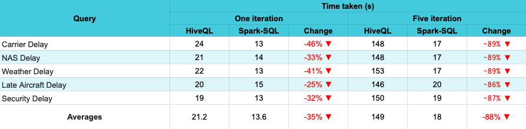

# BDAT Assignment (Mapreduce vs Spark)

## Dataset

According to a 2010 report made by the US Federal Aviation Administration, 
the economic price of domestic flight delays entails a yearly cost of 32.9 billion dollars
to passengers, airlines and other parts of the economy. More than half of that amount comes
from the pockets of passengers who not only lose time waiting for their planes to leave, but
they also miss connecting flights, spend money on food and have to sleep on hotel rooms while they're stranded.

## Mapreduce via HiveQL

With hive installed hql script can be run with the following arguments:

```shell
--hivevar delay_type_col_name=<column_name> // (CarrierDelay, etc.)
--hiveconf hive.session.id=calculate-flight-delay-<column_name>-1 // (CarrierDelay, etc.)
--hiveconf hive.execution.engine=mr
```

## Spark

With spark installed python script can be run with following arguments:

```shell
--data_source <data_source_path> 
--output_uri <output_path> 
--delay_type_col_name <column_name> // (CarrierDelay, etc.)
--iterations 1
```

## Comparison

See the below table for details on time consumption with queries and iterations.



## Presentation and Demo

Can check out the presentation on Mapreduce vs Spark and how each task is executed with the following video.

[Watch the video](https://drive.google.com/file/d/10x7jTuetRrKrgC8gFRyjz__U_6FlX7qn/view?usp=share_link)

## Author

Name: [Banura Randika Perera](https://github.com/randikabanura) <br/>
Linkedin: [randika-banura](https://www.linkedin.com/in/randika-banura/) <br/>
Email: [randika.banura@gamil.com](mailto:randika.banura@gamil.com) <br/>

## Show your support

Please ⭐️ this repository if this project helped you!

## License

See [LICENSE](LICENSE) © [randikabanura](https://github.com/randikabanura/)